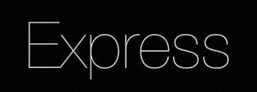
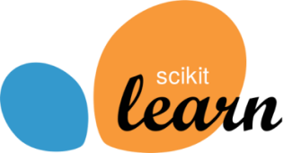

 <h1 align ="center">Hi there‼️ I'm Aditya</h1> 

## I'm a MERN developer!!

- 💻 I’m currently learning about <b>Microservice</b> 
- 🤜🏻🤛🏻 I welcome anyone to collaborate for any project on Web or ML
- 🎯 2021 Goals: Enhance problem solving skills
<h3 align="center">
  <code>
   < My Tech-Stack / >
  </code>
</h3>

    
   
   
   

 

    
   
   
   

[website]: https://adityak13.netlify.app/
